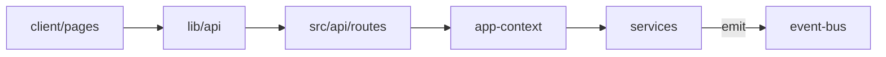

# Architecture

## Layout

```
server.ts                 # Entry: context + Express app
src/
  app-context.ts          # DI container, event bridges, operation registry
  config.ts               # Load + resolve paths + save
  config/schema.ts        # Defaults + validation
  properties-service.ts   # server.properties read/write
  core/
    event-bus.ts          # Cross-service events (server.*, pipeline.*)
    operation-registry.ts # Long-running job locks
  api/
    index.ts              # Mount feature routers
    http.ts               # ok / fail / json helpers
    middleware/
    routes/               # health, server, logs, update, backups, config, properties
  server-process.ts       # BDS process (no HTTP)
  update-pipeline.ts      # Orchestration (no HTTP)
  backup-service.ts
  extract-service.ts
client/                   # React + Vite + Tailwind + shadcn dashboard
  src/
    pages/                # Overview, Server, Updates, Backups, Properties, Settings
    hooks/                # useServerStatus, useServerLogs
    lib/api.ts            # fetch wrapper
public/                   # Vite production build output (static)
shared/                   # Shared TypeScript types
```

## Data flow



## How to add a feature

1. **Service** (if needed) — `src/my-service.ts`, register in [`src/app-context.ts`](../src/app-context.ts).
2. **Routes** — `src/api/routes/my-feature.ts`, mount in [`src/api/index.ts`](../src/api/index.ts).
3. **Operation lock** — if the job blocks start/stop/update, register on `ctx.operations` and use `requireIdle(ctx, ['myJob'])`.
4. **Types** — add types in [`shared/`](../shared/) and import them as needed.
5. **UI page** — `client/src/pages/MyFeaturePage.tsx`, add route in [`client/src/App.tsx`](../client/src/App.tsx).
6. **Docs** — endpoint row in [`docs/API.md`](API.md).

## Extension rules

- Routes use `ctx.getService('name')`, not `getInstance()` singletons.
- Services must not import Express or write HTTP responses.
- UI uses `client/src/lib/api.ts` only; no raw `fetch` scattered in pages.
- Subscribe to `ctx.bus` for server/pipeline events instead of patching `server-process.ts`.

## TypeScript build commands

| Command | Description |
|---------|-------------|
| `npm run build` | Compile server-side TS (`tsconfig.build.json`) → `dist/` |
| `npm run build:client` | Build React dashboard (`client/`) → `public/` |
| `npm run build:all` | Server + frontend build |
| `npm run typecheck` | Type-check server and client (`--noEmit`) |
| `npm run dev` | Run server via `tsx watch` (no build step) |
| `npm run dev:client` | Vite dev server with `/api` proxy to port 8080 |

The `shared/` directory provides shared TypeScript types used by both server and frontend builds.

**Local development:** run `npm run dev` and `npm run dev:client` in two terminals. Open `http://localhost:5173` for hot reload; API calls proxy to the Express server.

## Event bus topics

| Event | Source |
|-------|--------|
| `server.log` | Server stdout/stderr |
| `server.state` | Process state changes |
| `server.exit` | Process exit |
| `pipeline.step` | Update pipeline |
| `pipeline.complete` | Update success |
| `pipeline.error` | Update failure |
